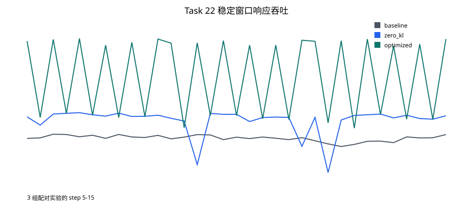

# Task 22 Hybrid-async 纯文本性能报告

## 结果

在实验提交 `056f4b47c2022910c780f497d42283a803dc2ea7` 上完成三组配对实验。移除系数为零的 KL reference 路径后，响应吞吐变化 +6.05%，端到端延迟变化 -6.20%；随后每两次 Actor 更新发布一次 Rollout 权重，吞吐进一步变化 +13.48%，延迟进一步变化 -10.74%。相对 baseline，组合改动使吞吐变化 +20.34%，延迟变化 -16.28%。
验收：**通过**。冻结目标为 `optimized` 相对 `zero_kl` 的响应吞吐至少提升 5%。

| 变体      | 权重发布间隔 | framework/E2E step (s) | 响应 tok/s | samples/s | 发布耗时/step (s) |      TIS | 整体 GPU 利用率 | Actor GPU 利用率 | Rollout GPU 利用率 | Actor 峰值 MiB | Rollout 峰值 MiB |
| --------- | -----------: | ---------------------: | ---------: | --------: | ----------------: | -------: | --------------: | ---------------: | -----------------: | -------------: | ---------------: |
| baseline  |            1 |            3.893/3.909 |     4206.2 |     8.220 |             0.664 | 0.999900 |          55.73% |           76.97% |             34.49% |          43978 |            80621 |
| zero_kl   |            1 |            3.670/3.667 |     4460.5 |     8.721 |             0.652 | 1.000026 |          55.66% |           74.29% |             37.02% |          43974 |            80621 |
| optimized |            2 |            3.234/3.273 |     5061.8 |     9.895 |             0.311 | 0.999972 |          63.47% |           85.12% |             41.82% |          51168 |            80623 |

GPU 利用率来自稳定窗口内的一秒采样，包含空闲的 0% 样本。`optimized` 的整体/Actor/Rollout 平均利用率分别为 63.47% / 85.12% / 41.82%；`zero_kl` 分别为 55.66% / 74.29% / 37.02%。

Actor 峰值显存从 baseline 的 43978 MiB （42.95 GiB）增至 optimized 的 51168 MiB （49.97 GiB），增加 7190 MiB （16.35%）；Rollout 峰值基本不变。当前采样只记录设备已用显存，没有区分 PyTorch allocated/reserved 或张量生命周期，因此不能把增量归因于某个单独张量。它与权重发布间隔改变后的流水重叠及缓存高水位同时出现，应作为性能收益的显存代价记录；在取得 allocator/timeline 原始证据前不作更强因果结论。

## 单次运行证据

| 变体      | run | steps | E2E p50/p95 (s) | 响应 tok/s |  reward |         loss |      TIS | samples | errors |
| --------- | --: | ----: | --------------: | ---------: | ------: | -----------: | -------: | ------: | -----: |
| baseline  |   1 |    20 |     4.000/4.000 |     4234.5 | -1.0000 |            0 | 0.999837 |     352 |      0 |
| baseline  |   2 |    20 |     4.000/4.000 |     4215.7 | -1.0000 |            0 | 0.999934 |     352 |      0 |
| baseline  |   3 |    20 |     4.000/4.000 |     4168.3 | -1.0000 |            0 | 0.999931 |     352 |      0 |
| zero_kl   |   1 |    20 |     4.000/4.000 |     4542.0 | -1.0000 |            0 | 1.000155 |     352 |      0 |
| zero_kl   |   2 |    20 |     4.000/4.000 |     4403.7 | -1.0000 |            0 | 0.999925 |     352 |      0 |
| zero_kl   |   3 |    20 |     4.000/5.000 |     4435.8 | -0.9943 |  5.66312e-06 | 0.999998 |     352 |      0 |
| optimized |   1 |    20 |     3.000/4.000 |     5090.9 | -1.0000 |            0 | 0.999968 |     352 |      0 |
| optimized |   2 |    20 |     3.000/4.000 |     5049.3 | -1.0000 |            0 | 1.000041 |     352 |      0 |
| optimized |   3 |    20 |     3.000/4.000 |     5045.3 | -0.9943 | -1.50305e-05 | 0.999906 |     352 |      0 |

## 配对变化

| run | zero-KL 吞吐变化 | interval-two 吞吐变化 | 总吞吐变化 | 总延迟变化 |     seed |
| --: | ---------------: | --------------------: | ---------: | ---------: | -------: |
|   1 |           +7.26% |               +12.08% |    +20.22% |    -16.28% | 20260802 |
|   2 |           +4.46% |               +14.66% |    +19.77% |    -16.28% | 20260803 |
|   3 |           +6.42% |               +13.74% |    +21.04% |    -16.28% | 20260804 |

## 吞吐曲线



## 固定工作量与方法

- 硬件：物理 GPU 2 和 3，均为 NVIDIA RTX PRO 6000 Blackwell；Actor 1 卡、Rollout 1 卡。
- 主机：128 个逻辑 CPU（INTEL(R) XEON(R) GOLD 6530），内存 503.5 GiB。
- 运行时：Python 3.12.3；Torch 2.11.0+cu130（CUDA 13.0）；driver 580.173.02；Ray 2.56.1；SGLang 0.5.12.post1；Transformers 5.6.0。
- 模型：Qwen3-0.6B；模型 SHA-256 `f47f71177f32bcd101b7573ec9171e6a57f4f4d31148d38e382306f42996874b`。本地绝对路径不进入交付报告。
- 数据：ModelScope `AI-ModelScope/gsm8k` main 中固定 16 个 prompt，SHA-256 `c992e09c748ae19e82ad6d4fda099eae01ce987414372a47834c901403e2c7e4`；没有手写大数据集。
- 每个组件运行 20 steps；每 step 8 prompts × 4 samples，有效 batch 32，response cap 512。
- 异步策略：Hybrid、max staleness 2、启用 TIS。baseline/zero_kl 每 step 发布；optimized 每两 step 发布。
- 动态 batch：所有变体每卡训练/log-prob token budget 均为 8192/8192。
- 性能窗口：记录的 step 5-15（共 11 个观测）。主要吞吐使用高精度 `perf/step_time`；Actor completion N-1 到 N 的 E2E 间隔只有一秒时间戳精度，因此作为次要指标。
- GPU 窗口：Actor completion 4 至 15；利用率和峰值显存只使用该窗口，且包含空闲 0% 样本。
- 三组实验采用轮换顺序，降低 warm-cache 和运行顺序偏差。

## 优化原理

`baseline` 保留原始配置：`--use-kl-loss --kl-loss-coef 0.00` 加 `--ref-load`。`zero_kl` 移除未使用的 reference 路径，同时保留 8192-token 动态 batch 预算。KL 项严格乘以零，因此该改动移除计算但不改变标量目标。

`optimized` 基于 `zero_kl` 设置 `--update-weights-interval 2`。Hybrid 在奇数完成 step 跳过 Rollout pause、权重传输和 resume endpoint，同时仍在间隔边界、最后一步以及评测前强制发布。

该方法有意用额外一次 Actor update 的 Rollout policy freshness 换取更低的发布开销。`--max-staleness 2` 约束现有异步流水；TIS、loss、reward 和 clipping 指标是正确性护栏，不能证明长期收敛等价。

日志记录每个 zero_kl 作业平均发布 21 次权重，每个 optimized 作业发布 11 次；两者均包含一次共同的初始化发布。

所有变体的 weight-update buffer 固定为 512 MiB；先前测试的 1 GiB buffer 不进入本实验。

## 未采用的方向

- weight-update buffer 从 512 MiB 增至 1 GiB，三组实验吞吐只提升 +1.12%。
- train/log-prob budget 增至 12288/24576 后，相对 `zero_kl` 吞吐下降 -1.52%；log-prob forward 加快，但 Actor training 的回退抵消了收益。

## 正确性护栏

全部 9 个组件作业均完成 20 steps；意外非有限指标为 0，运行时错误为 0。
每个作业生成 640 个样本。单次运行平均 TIS 范围为 0.999837-1.000155，最大平均 TIS clip fraction 为 0.000000。
已有的未知设备 `perf/device_peak_tflops=inf` sentinel 单独计数，不视为训练异常。
该短实验只建立运行时等价护栏，不证明长期收敛等价。

## 复现与回退

```bash
cd /path/to/Relax
MODEL_PATH=/path/to/Qwen3-0.6B CUDA_VISIBLE_DEVICES=2,3 TOTAL_TRIALS=3 \
  bash benchmarks/task22_hybrid_async_text/run_paired_trials.sh
```

设置 `TASK22_VARIANT=zero_kl UPDATE_WEIGHTS_INTERVAL=1` 可只关闭 interval-two 发布；设置 `TASK22_VARIANT=baseline` 可回退两个改动。

生成文件：`summary.csv`、`step_metrics.csv` 和 `throughput_curves.svg`。
当前已提交文件的校验值见 [committed-evidence.sha256](committed-evidence.sha256)；该清单不能替代下述原始日志证据包。

## 原始证据交付

- 脱敏原始证据包：[raw-evidence.tar.gz](raw-evidence.tar.gz)
- 文件级索引：[raw-evidence-index.csv](raw-evidence-index.csv)
- 压缩包校验：[raw-evidence.sha256](raw-evidence.sha256)
- 当前压缩包 SHA-256：`942493fe8de041b882be4e98d39bde55615cacec607f1a075b80b4b8ed1db76d`。

拿到实验机上的 `benchmark_artifacts/task22-hybrid-async-text-v3/` 后，执行：

```bash
python benchmarks/task22_hybrid_async_text/package_evidence.py \
  --artifact-root benchmark_artifacts/task22-hybrid-async-text-v3 \
  --output-dir benchmarks/results/task22-hybrid-async-text
python benchmarks/task22_hybrid_async_text/analyze.py
```

打包器要求 3 个变体 × 3 次运行全部具备 `manifest.txt`、`submit.log`、`train.log` 和 `gpu.csv`；它会脱敏 home path、私网 IP、邮箱、URL credentials 和 secret-like assignments，并同时记录原文件与交付文件的 SHA-256。
