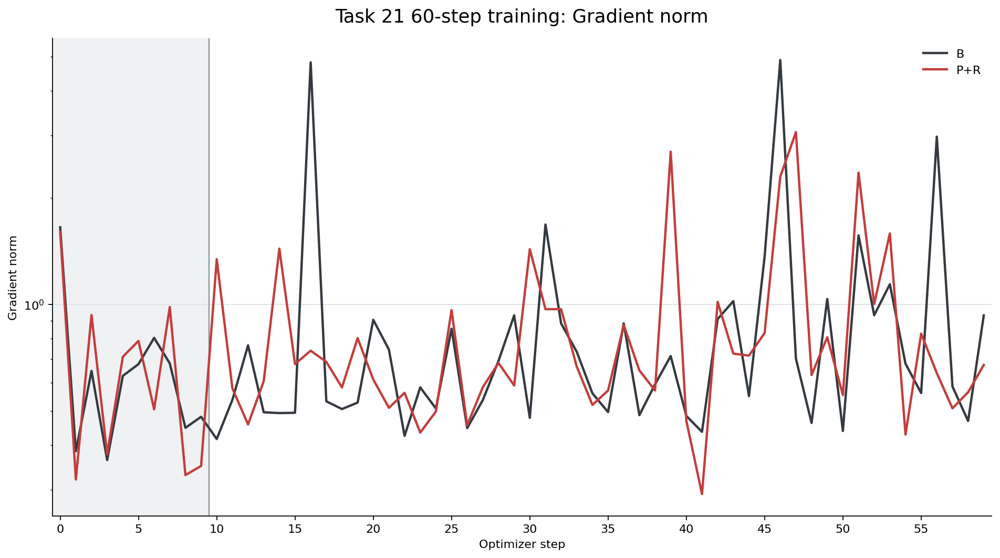
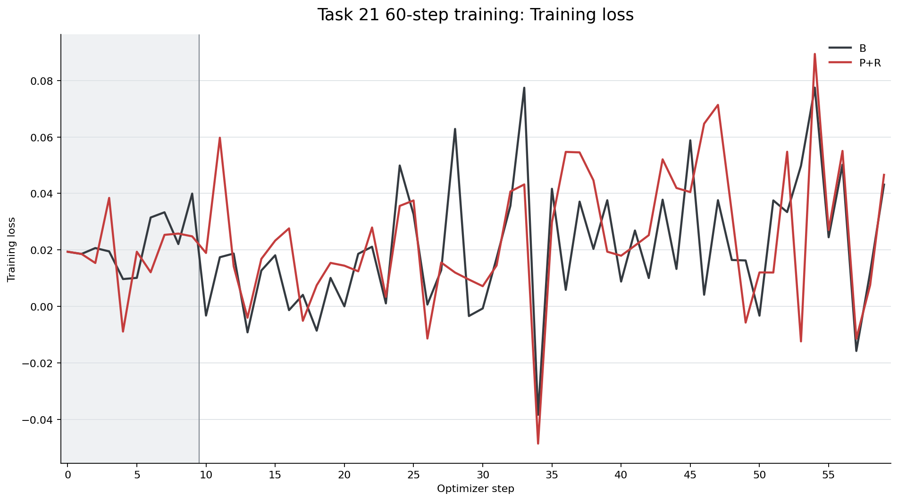
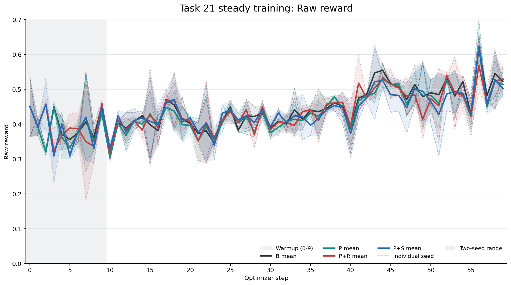

# Task 21: 60-step Hybrid multimodal training benchmark

## Result

Campaign `CURVE60-BR-e2be8cd-20260821-1120-GPU01247` completed 60 optimizer
steps for both conditions on seed `20260820`. The benchmark uses the
Qwen3-VL-8B-Instruct / OpenR1-Multimodal workload on physical GPUs
`0,1,2,4,7`: four actor GPUs (`TP=2`, `CP=2`, `DP=1`) and one rollout GPU.

| Condition | ProcessorPool | Train-forward log-prob reuse | Step token throughput | Mean step time | Response-token throughput | Raw reward mean | Grad-norm max |
| --- | ---: | ---: | ---: | ---: | ---: | ---: | ---: |
| B60 | 0 | 0 | 964.68 token/s | 203.62 s | 484.37 token/s | 0.44359 | 4.89165 |
| P+R60 | 8 | 1 | 1,475.17 token/s | 131.71 s | 734.88 token/s | 0.43805 | 3.06235 |

P+R60 reaches `1.529x` the B60 step-token throughput and reduces mean step
time by `35.31%` at the same seed and workload. Both runs report zero training,
validation, and final exit status.

## Protocol

- Benchmark commit: `e2be8cd158609cc2dfae72b7ba92df72cacb3091`.
- Seed: `20260820`.
- Run length: 60 optimizer updates, steps `0` through `59`.
- Warmup: steps `0-9`; analyzer measurement scope: steps `10-59` (50 measured
  points per run).
- Work per update: 256 generated samples, one image per sample, response cap
  1024.
- Curves: direct TensorBoard scalar exports with no smoothing or interpolation.

The two control configurations are:

| Condition | Environment controls |
| --- | --- |
| B60 | `MM_PROCESSOR_POOL_SIZE=0 HYBRID_REUSE_TRAIN_LOGPROBS=0 HYBRID_PIPELINE_FORWARD=0 HYBRID_PIPELINE_OVERLAP=0` |
| P+R60 | `MM_PROCESSOR_POOL_SIZE=8 HYBRID_REUSE_TRAIN_LOGPROBS=1 HYBRID_PIPELINE_FORWARD=0 HYBRID_PIPELINE_OVERLAP=0` |

## Training curves

The CSV contains 120 rows: 60 points for B60 and 60 points for P+R60. The
machine-readable summary records run IDs, controls, aggregate metrics, and
validation status.

- [`sixty_step_training_curves.csv`](sixty-step/sixty_step_training_curves.csv)
- [`sixty_step_summary.json`](sixty-step/sixty_step_summary.json)
- [`sixty-step/README.md`](sixty-step/README.md)
- [`SHA256SUMS`](SHA256SUMS)

## Validation

The analyzer reports `measurement_scope=steady_state` and `validation=passed`
for both runs. Each run has 60 finite points in `train/grad_norm`, `train/loss`,
and `rollout/raw_reward`; the 50 measured points also have finite throughput,
step-time, reward, PPO-KL, and gradient metrics. The recorded run artifacts are:

- B60: `CURVE60-BR-e2be8cd-20260821-1120-GPU01247-B60-GPU01247-seed20260820-attempt1`
- P+R60: `CURVE60-BR-e2be8cd-20260821-1120-GPU01247-R60-GPU01247-seed20260820-attempt1`
