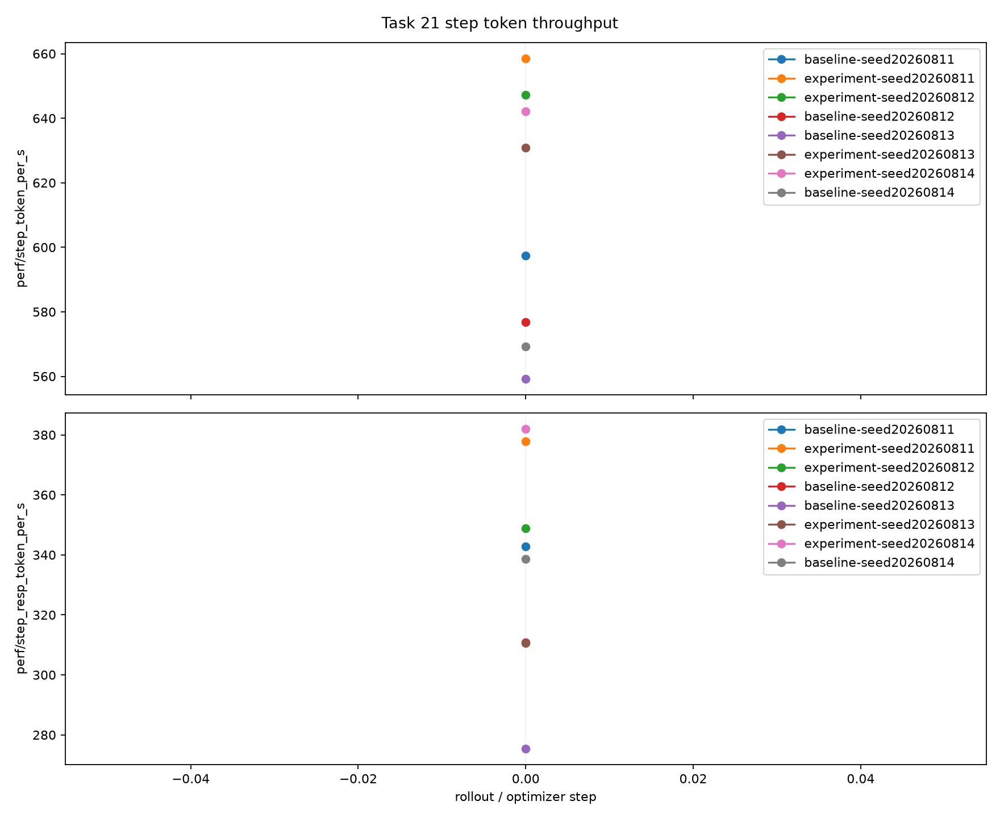
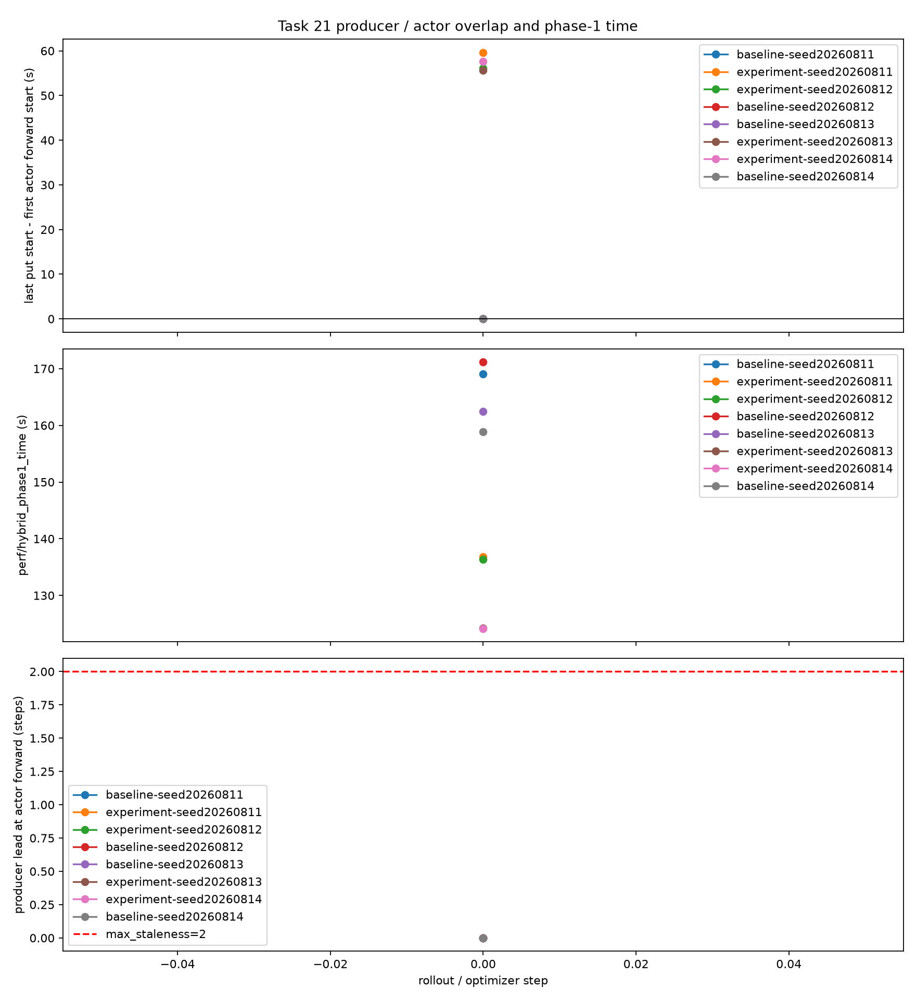
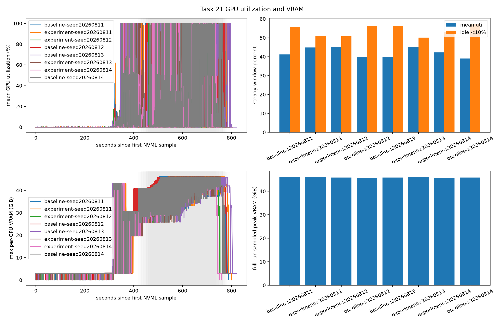
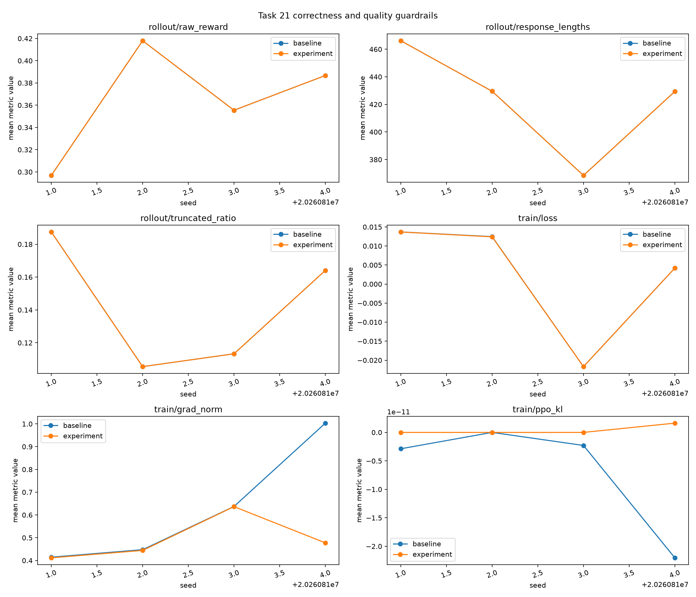
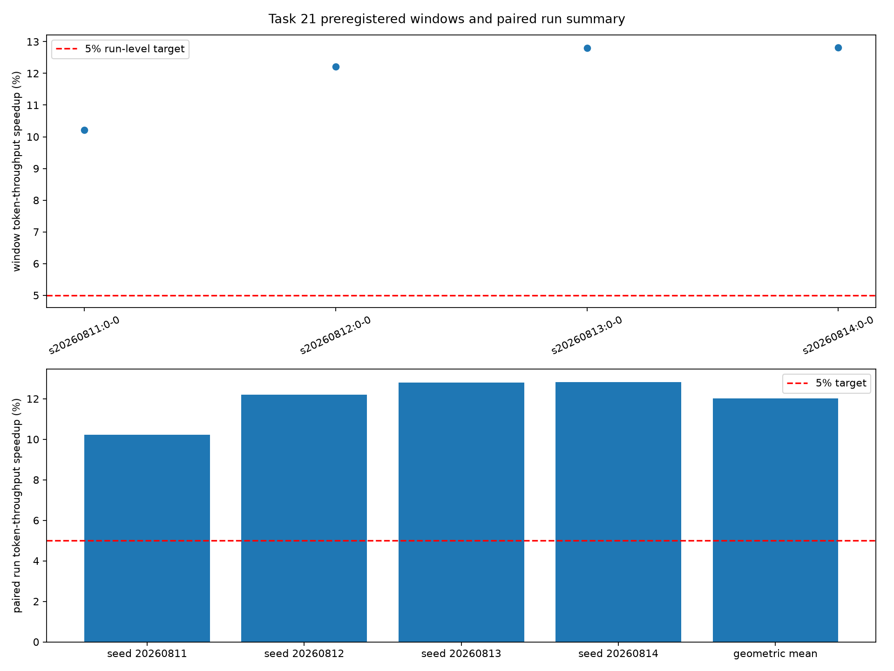

# Task 21: Hybrid-async multimodal pipeline benchmark results

## Steady-state result

The formal steady-state campaign completed on commit `e2be8cd158609cc2dfae72b7ba92df72cacb3091` using physical GPUs `0,1,2,6,7`: actor TP2 x CP2 x DP1 on four GPUs and one rollout engine on one GPU. Each B/P/P+R/P+S condition used two paired seeds (`20260816`, `20260817`), 40 optimizer updates, 10 warmup updates, and measured windows `10-19`, `20-29`, and `30-39`.

| Condition | Steady token throughput (mean, range) | Samples/s (mean) | Geomean vs reference |
|---|---:|---:|---:|
| B | 1,209.50 (1,144.11-1,274.89) token/s | 1.562 | reference |
| P | 1,197.49 (1,184.17-1,210.81) token/s | 1.516 | -0.85% token/s vs B |
| P+R | 1,565.68 (1,559.71-1,571.65) token/s | 1.988 | **+29.64% token/s vs B**; +30.75% vs P |
| P+S | 1,188.79 (1,142.59-1,234.99) token/s | 1.498 | -1.64% token/s vs B |

P+R is positive in both paired seeds (`+36.33%`, `+23.28%` token/s vs B), with a 21.50% geometric-mean step-time reduction. The ProcessorPool-only and chunk-overlap paths do not show a sustained throughput gain in this campaign; their values remain reported as attributable ablations rather than being combined into the P+R claim.

The three warmup-excluded window means (token/s) were:

| Condition | 10-19 | 20-29 | 30-39 |
|---|---:|---:|---:|
| B | 1,221.46 | 1,188.81 | 1,219.31 |
| P | 1,202.85 | 1,204.60 | 1,185.82 |
| P+R | 1,556.00 | 1,565.52 | 1,575.02 |
| P+S | 1,198.25 | 1,178.24 | 1,190.35 |

## 60-step P+R training curves

This 60-optimizer-step benchmark pairs a fresh B control with P+R on seed
`20260820`, using the same Qwen3-VL-8B workload and five-GPU layout. The curves
show every optimizer step from `0` through `59` directly from TensorBoard
scalar exports, without smoothing or interpolation; the shaded `0-9` interval
is warmup.

| Condition | Steady token throughput | Mean step time | Response-token throughput | Raw reward mean | Grad-norm max |
| --- | ---: | ---: | ---: | ---: | ---: |
| B60 | 964.68 token/s | 203.62 s | 484.37 token/s | 0.44359 | 4.89165 |
| P+R60 | 1,475.17 token/s | 131.71 s | 734.88 token/s | 0.43805 | 3.06235 |

P+R60 is `1.529x` the B60 token throughput and reduces mean step time by
`35.31%` in this same-seed comparison. Both runs completed all 60
steps with finite `train/grad_norm`, `train/loss`, and `rollout/raw_reward`
series; training, validation, and final exit status are all zero.

The per-step data and machine-readable run summary are available in
[`sixty_step_training_curves.csv`](sixty-step/sixty_step_training_curves.csv)
and [`sixty_step_summary.json`](sixty-step/sixty_step_summary.json). The
P+R attribution is `MM_PROCESSOR_POOL_SIZE=8`,
`HYBRID_REUSE_TRAIN_LOGPROBS=1`, and `HYBRID_PIPELINE_FORWARD=0`; the queue
records this run under its `R60` label.

## Protocol

- Performance-code commit: `780c742793fea54acdb28cb40ffb591fb909ba51`.
- Base commit: `9a5674afde12f608698ab4f60cdb9849a0eb6cb3`.
- Hardware: physical RTX A6000 GPUs `1,2,3,4,6`; four actor GPUs (`TP=2`, `CP=2`) plus one rollout GPU.
- Workload: Qwen3-VL-8B-Instruct, OpenR1-Multimodal, 256 generated samples per run, response cap 1024, one real optimizer step.
- Design: paired seeds `20260811`–`20260814`, ABBAABBA order; baseline and experiment differ only in `--hybrid-pipeline-overlap`.
- Statistics: four fresh-process paired runs, each containing one optimizer step. The analyzer validated every run and all preregistered first-step targets.

These results measure first-step latency and throughput under the fixed Qwen3-VL,
TP2 x CP2 x DP1 profile. They do not establish steady-state training
throughput. A steady-state claim requires multi-step runs with warmup excluded
and later measurement windows declared before analysis.

## Result summary

| Metric | Baseline | Experiment | Result |
|---|---:|---:|---:|
| step token throughput, arithmetic mean | 575.68 token/s | 644.69 token/s | paired geometric-mean speedup **12.01%** |
| hybrid phase-1 time, arithmetic mean | 165.38 s | 130.38 s | paired geometric-mean reduction **21.21%** |
| end-to-end step time, arithmetic mean | 342.24 s | 305.61 s | **10.70% lower** |
| producer/actor overlap | 0/4 runs | 4/4 runs | **100%** experiment overlap |
| first-step-window GPU utilization, arithmetic mean | 40.01% | 44.37% | +4.36 percentage points |
| sampled peak VRAM, maximum | 47,380 MiB | 47,140 MiB | no regression |

Every paired run exceeded the preregistered 5% throughput target: `10.22%`, `12.21%`, `12.80%`, and `12.82%`. Every pair also reduced phase-1 time by `19.11%`–`23.53%`.

The throughput plot shows both total-token and response-token throughput for each matched seed. The experiment point is above its baseline point in every pair.

The phase-1 plot shows the producer/actor overlap interval, phase-1 latency, and producer lead. The experiment overlaps producer work with actor forward in all four runs, while the baseline deliberately disables that overlap.

The GPU plot combines the 500 ms NVML time series with first-step-window utilization, idle ratio, and sampled peak VRAM. It describes these fresh-process runs only.

The quality plot pairs reward, response length, truncation, loss, gradient norm, and PPO KL by seed. Workload, reward, response length, and truncation are exact within each pair; loss differs by at most `6.21e-5`, PPO KL remains within `2.37e-11`, and every value is finite. Seed `20260814` shows a disclosed gradient-norm difference (`1.0033` vs `0.4775`) caused by different asynchronous microbatch grouping; the deterministic replay parity run controls grouping and bounds the patched-path gradient-norm difference to `0.207%`.

The window summary shows each paired throughput speedup and the geometric mean against the preregistered 5% threshold.

## Correctness evidence

The final replay parity dataset contains 1,024 samples across four actor ranks. Baseline/control/experiment agree exactly for tokens, response lengths, loss masks, rewards, raw rewards, advantages, returns, truncation flags, multimodal tensors, and dynamic-microbatch schedules. Loss is exactly `0.03446025028824806`; experiment log-probability maximum absolute difference is `2.3842e-7`; gradient-norm symmetric relative difference is `0.207%` (below the BF16 0.5% guardrail).

Full raw logs, manifests, TensorBoard events, timeline JSONL, NVML CSV, summaries, and generated figures are stored under `/data01/LWX/relax-task21/`. Compact paired data and checksums are included in this directory.
