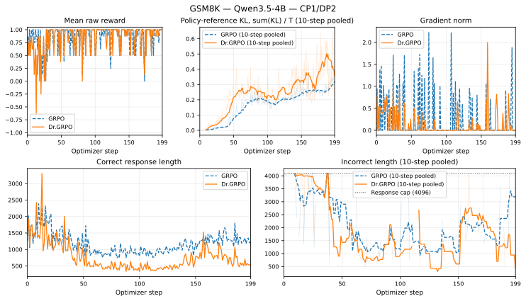

# Dr.GRPO 200-Step 训练报告

本文记录用于验证 Relax Dr.GRPO 实现的等预算 Qwen3.5-4B GSM8K 对照实验。每种算法只运行一次，因此这是实现与稳定性研究，不是 Dr.GRPO 普遍优于 GRPO 的统计结论。

## 范围与证据边界

- Pull request：[Relax #239](https://github.com/redai-infra/Relax/pull/239)
- 算法：GRPO 与 Dr.GRPO
- 正式预算：每个 run 严格运行 200 个 optimizer step
- Response：每个 run 3,200 条（`200 * 16`）
- 硬件：4 x NVIDIA H20
- 实验源码 base：`62022e01ce4cbe48b4720bcf20335af2415e41ec`
- 实验 patch SHA256：`e0f560236024420b51e03124b03b7041c9c0936f5d431de81c4fc770191b1f03`
- 冻结实验 worktree SHA256：`30ab4f7524e378bba6350d0b67641090485c5b904fc375eb8e51ba726fb876e7`
- 容器镜像：`ghcr.io/redai-infra/relaxrl@sha256:d6ee9f015f1a92987931ed5f7229e6cfb6f089bba9fa8e6bc1ea289c2503a7af`

::: warning 待发布的证据包
脱敏证据 archive 已在本地生成并通过 SHA256 校验。在 PR 的证据更新完成前，还必须补充公开 GitHub Release URL 和最终的干净复现 commit。目前通过 base commit、归档 patch 和 worktree hash 共同标识实验源码。
:::

已准备的 path-free 主证据 archive SHA256 为 `7510d747a3f3371e52a84f19315fde5f7cc54c9438c5d30970fab4dec465c96c`。单独的 1,600-dump loss-mask 源 archive SHA256 为 `521c554bb11b2c5891e72e103eb669286dbf7b1531903f7b258773deeaae28f3`。

仓库内发布了下文使用的轻量、无本地路径结果：

- [全部 400 条 optimizer-step 记录](../../public/dr-grpo/training_metrics_long.csv)；
- [逐 run 汇总](../../public/dr-grpo/training_summary.json)；
- [机器可读实验 manifest](../../public/dr-grpo/experiment_manifest.json)；
- [结果表](../../public/dr-grpo/tables.md)；
- [训练曲线](../../public/dr-grpo/training_curves.svg)。

Git 仓库不保存 checkpoint、模型权重、完整 GSM8K 源数据、原始日志、rollout JSONL 或 per-rank 训练 dump。

## 冻结环境与工作负载

| 项目 | 值 |
|---|---|
| 模型 | `Qwen/Qwen3.5-4B`，revision `851bf6e806efd8d0a36b00ddf55e13ccb7b8cd0a` |
| 精度 / 更新方式 | BF16 / 全参数更新 |
| Python / PyTorch | 3.12.3 / 2.11.0+cu129 |
| CUDA / NCCL | 12.9 / 2.28.9 |
| Ray / SGLang | 2.57.0 / 0.5.15.post1 |
| Transformer Engine | 2.14.1 |
| 并行配置 | TP2、PP1、CP1、DP2 |
| Batch | 4 个 prompt x 4 条 response；global batch 16 |
| Response budget | 4,096 tokens |
| Optimizer steps | 每种算法 200；没有事后截断 |
| Optimizer | Adam，`lr=1e-6`，betas `(0.9, 0.98)`，weight decay `0.1`，constant LR |
| PPO clipping | low `0.2`，high `0.28` |
| KL / entropy 系数 | reward-side KL `0`；explicit KL `0`；entropy `0` |
| Sampling | temperature `0.7`，top-p `0.8`，top-k `20` |
| Seeds | train `1234`，rollout `42`，dataset shuffle `42` |

两个 job 都设置了 `--num-rollout 200`，均产生 `0.jsonl` 到 `199.jsonl` 的 rollout、800 个 per-rank dump，并到达 iteration-199 checkpoint。两个接受 run 中都不存在 `0..199` 之外的 step。

## 模型与数据准备

下载固定的模型 revision：

```bash
hf download Qwen/Qwen3.5-4B \
  --revision 851bf6e806efd8d0a36b00ddf55e13ccb7b8cd0a \
  --local-dir /path/to/Qwen3.5-4B
```

下载固定的 GSM8K train parquet，并构建准确的 256 行训练子集：

```bash
hf download openai/gsm8k main/train-00000-of-00001.parquet \
  --repo-type dataset \
  --revision 740312add88f781978c0658806c59bc2815b9866 \
  --local-dir /path/to/gsm8k-pinned

python scripts/testing/convert_gsm8k_for_dr_grpo_e2e.py \
  --input /path/to/gsm8k-pinned/main/train-00000-of-00001.parquet \
  --output /path/to/gsm8k-train-shuffle42-first256.jsonl

sha256sum /path/to/gsm8k-train-shuffle42-first256.jsonl
```

当输入 SHA256 不是 `ea82612ea9582142387730c793eb67d3b12849002bc0b7fa6f8efafa7351419d` 时，converter 会直接拒绝。它使用 `random.Random(42)` 打乱全部 7,473 条 train 数据，保留前 256 条，将最终 `####` 后的答案转换为 scalar label，并要求输出 SHA256 为：

```text
8f8580875e50e5da2828ad586f97ee20e55f3ac1dfd7a6f019103ddad1a0f9d1
```

本实验没有使用 `gsm8k-test.jsonl` 或 GSM8K test split。

## 复现命令

拉取 immutable image，并启动隔离的四卡容器，将仓库、模型、数据和输出目录挂载到 recipe 使用的路径：

```bash
docker pull ghcr.io/redai-infra/relaxrl@sha256:d6ee9f015f1a92987931ed5f7229e6cfb6f089bba9fa8e6bc1ea289c2503a7af
```

运行 GRPO control arm：

```bash
MODEL_PATH=/path/to/Qwen3.5-4B \
PROMPT_SET=/path/to/gsm8k-train-shuffle42-first256.jsonl \
OUTPUT_DIR=/path/to/output/grpo \
TRAIN_DATA_DIR=/path/to/output/grpo/train_data \
TENSORBOARD_DIR=/path/to/output/grpo/tensorboard \
NUM_ROLLOUT=200 \
ADVANTAGE_ESTIMATOR=grpo \
RUN_ID=qwen35-4b-grpo-cp1-final \
SAVE_CHECKPOINT=1 \
SAVE_INTERVAL=50 \
NCCL_NVLS_ENABLE=0 \
bash scripts/training/text/run-qwen35-4B-4xgpu-dr-grpo.sh
```

control arm 结束并关闭其 Ray Serve 状态后，从同一个初始模型运行 Dr.GRPO：

```bash
MODEL_PATH=/path/to/Qwen3.5-4B \
PROMPT_SET=/path/to/gsm8k-train-shuffle42-first256.jsonl \
OUTPUT_DIR=/path/to/output/dr_grpo \
TRAIN_DATA_DIR=/path/to/output/dr_grpo/train_data \
TENSORBOARD_DIR=/path/to/output/dr_grpo/tensorboard \
NUM_ROLLOUT=200 \
ADVANTAGE_ESTIMATOR=dr_grpo \
RUN_ID=qwen35-4b-dr-grpo-cp1-final \
SAVE_CHECKPOINT=1 \
SAVE_INTERVAL=50 \
NCCL_NVLS_ENABLE=0 \
bash scripts/training/text/run-qwen35-4B-4xgpu-dr-grpo.sh
```

recipe 固定了其余所有算法、optimizer、sampling、batch 和并行参数。脱敏证据包中保留了由 `bash -x` 输出的两条完整 `ray job submit -- python3 -m relax.entrypoints.train ...` 展开命令。

## 指标生成

报告由两份原始训练日志、400 个 rollout JSONL，以及 1,600 个未修改的 per-rank `--save-debug-train-data` dump 生成：

```bash
python scripts/testing/summarize_dr_grpo_qwen35_gsm8k.py \
  --experiment-root /path/to/paired-experiment \
  --output-dir /path/to/report \
  --num-steps 200 \
  --response-budget 4096 \
  --global-batch-size 16 \
  --world-size 4 \
  --model-parallel-size 2
```

一次执行会校验全部预期文件与字段，并生成 `training_metrics_long.csv`、`training_summary.json`、`tables.md`、`training_curves.svg` 和 `incorrect_length_10step_pooled.svg`。不存在手工的 CSV-to-table 或 CSV-to-SVG 步骤。

### 真实 Loss-Mask Token Count

`train/loss_mask_tokens` 是最终训练 `loss_masks` 的精确整数和，而不是 `sum(response_length)`。每个接受 step 都有四份 Actor-rank dump。分析首先确认 TP replica 具有完全相同的 sample-mask signature，然后只保留一份，再对其余 DP shard 求和得到全局 `T`。如果缺少 step/rank、replica mask 不一致、mask 不是 binary，或者重建出的 global sample count 不等于 16，分析会直接失败。

单独的证据 archive 保留全部 1,600 个源 dump 和每个文件的 SHA256；主证据 archive 保留逐 step 精确计数和完整生成 CSV。

随后将 `train/reference_kl` 重建为严格的 `sum(KL) / T`。对 Dr.GRPO，使用 `N * B` 还原 logged fixed-budget component，再除以真实 `T`。对 GRPO，先撤销 CP1 历史行为中的逐 response floor；两个接受 run 中都没有 fully masked response。若某一步为 zero-token，则该指标会标记为不可用，而不是执行除零。

## 结果

| 算法 | Reward all / last 20 | Accuracy | Correct length all / last 20 | Incorrect length all / last 20 | 真实 T | Grad norm mean / p95 / max |
|---|---:|---:|---:|---:|---:|---:|
| GRPO | 0.83125 / 0.86250 | 91.5625% | 1067.9 / 905.3 | 2969.2 / 2833.7 | 3,930,695 | 0.4466 / 2.4393 / 8.7898 |
| Dr.GRPO | 0.85750 / 0.91250 | 92.8750% | 929.7 / 948.5 | 2248.4 / 3139.9 | 3,275,766 | 0.1032 / 0.5420 / 2.0179 |

Accuracy 对每个 run 的全部 3,200 条 response 做 pooled 统计。Length mean 按 response count 加权，而不是给每一步的 mean 相同权重。Last-20 窗口为 optimizer step 180 到 199。



全部 200 step 上按真实 token pooled 的 policy-reference KL，GRPO 为 `0.31151`，Dr.GRPO 为 `0.16972`。Inference/training probability mismatch 保持较小：GRPO 和 Dr.GRPO 的 mean `train/train_rollout_prob_abs_diff` 分别为 `0.003474` 和 `0.003470`。

两个 job 都成功完成，没有 OOM、NCCL failure、NaN/Inf metric 或训练 traceback。每个 run 都保留 iteration 49、99、149、199 的 checkpoint。Checkpoint 只用于运行恢复，不进入公开证据包。

## 局限

1. 每种算法只有一次随机运行。Reward、accuracy、length、KL 或 gradient norm 差异只描述这一对 run，不能证明统计优越性。
2. 训练使用固定的 256-prompt GSM8K train 子集，不是 test split 或完整 benchmark evaluation。
3. `kl_loss_coef=0`，因此 reference KL 只作为诊断指标，不参与优化目标。
4. 正式 run 覆盖 dense Qwen3.5-4B 与 CP1。Dr.GRPO 当前拒绝 MoE、非 policy loss、纯 fully-async 训练和 `--normalize-advantages`。
5. 两个正式 run 中没有 fully masked response 或 zero-token optimizer window；这些边界由 focused regression test 覆盖。

在这些限制下，两种算法都完成了完全相同且预先声明的 200-step 预算，报告使用真实训练 loss-mask count；本次 Dr.GRPO run 的 pooled accuracy 高于 GRPO control，同时 gradient norm 更低。

## 下一步

- [Dr.GRPO 训练](./dr-grpo-training.md) — 算法契约与支持配置
- [算法参考](../examples/algorithms.md) — 对比 Relax policy-gradient estimator
- [配置说明](./configuration.md) — 查看训练与 rollout 参数
